# Intel Architecture and Windows 10

There are two primary assembly syntaxes :

- Intel
  - x86 (32-bit)
  - x86_64 (64-bit)
- AT&T

## Intel Architecture

In the Intel assembly languages, both the 32-bit and the 64-bit are quite similar at assembly level and make use of stack, heap and registers to carry out different instructions. The 64-bit version is just an extension to the 32-bit version.

Memory space supported :

32 bit - 2 GB \
64 bit - 128 TB

The registers in the 32-bit environment can be found in the below table : 

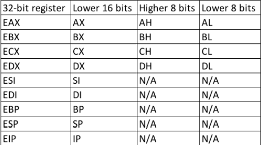

The registers in the 64-bit environment can be found in the below table : 

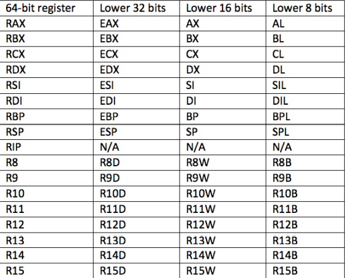

The most important registers in the 32-bit are the ESP and the EIP. They are the Stack pointer and the Instruction pointer. Their 64-bit counterparts are the RSP and the RIP.

ESP/RSP - Memory address to the top of the stack
EIP/RIP - Address of the assembly instruction to be executed.

Two types of instructions :

- Function calls
- Conditional Branching

## Intro to Windbg

Windbg can be found on the microsoft store. It supports 32-bit and 64-bit. Open notepad and start windbg

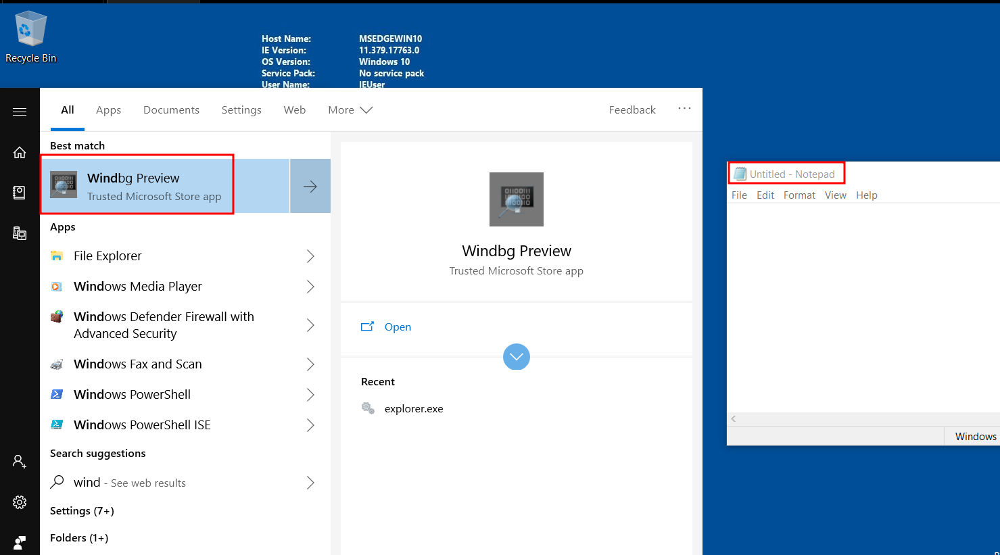

Go to File > Start Debugging > Attach to a process

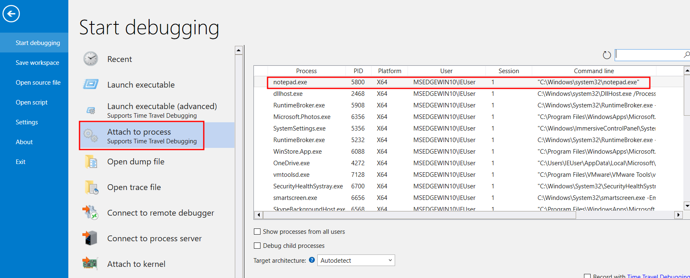

Below we can see the interface with the attached process. The process execution is paused. Now let us set a breakpoint at the WriteFile Function. The breakpoint will be encountered when the process writes something to the file.

> **bp** is used to set breakpoint \
> **kernel32** is the dynamic link library(DLL) which exports the **WriteFile** function \
> **WriteFile** is the function that gets called when anything is written onto the disk \
> **g** is used to resume the execution after the breakpoint has been hit \
> **p** is used to step through a single assembly instruction at a time \
> **r** is used to view all registers 

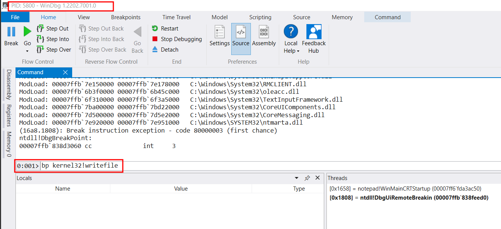

Now resume the execution. Write something on notepad to trigger the breakpoint.

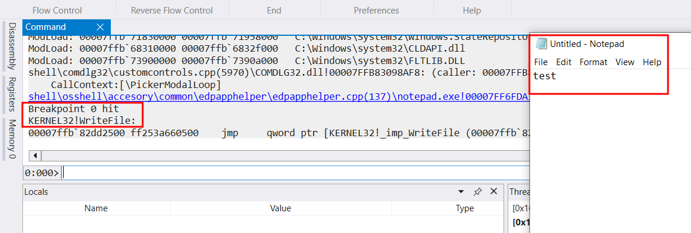

Now we can go step-by-step to the next instruction with the 'p' command.

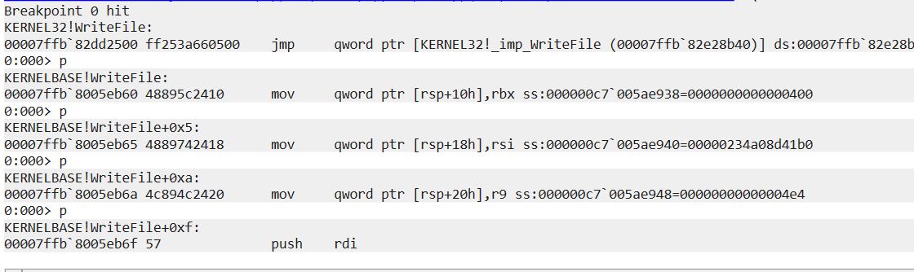

We can view the next 7 instructions with the 'u' command which stands for unassemble.

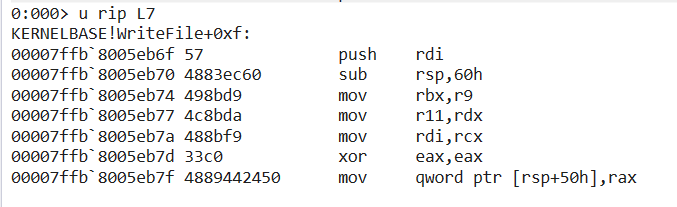

We can also view all the registers with the 'r' command.

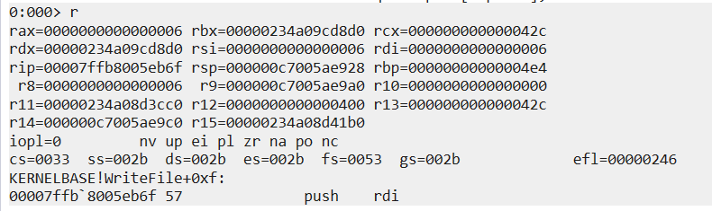

We can get the detailed view of the registers using the dd, dc and dq command.

dd - 32 bit 
dc - 32 bit with ASCII 
dq - 64 bit

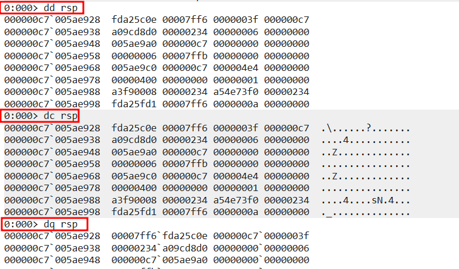

Finally we can also modify the stack with the 'ed' command.

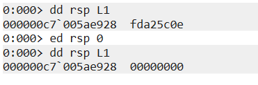

> RESOURCES :
>
> - https://en.wikipedia.org/wiki/X86
> - https://en.wikipedia.org/wiki/Assembly_language
> - https://en.wikipedia.org/wiki/X86-64
> - https://docs.microsoft.com/en-us/windows-hardware/drivers/debugger/methods-of-controlling-breakpoints
> - https://docs.microsoft.com/en-us/windows/win32/api/fileapi/nf-fileapi-writefile?redirectedfrom=MSDN

&nbsp;

# AntiMalware Scan Interface

## Basic Understanding

The AntiMalware Scan Interface, aka AMSI was introduced by Microsoft to allow runtime inspection of PowerShell commands and scripts. It captures all scripts, like C#, VBA, PowerShell etc. and send them to the AV for scanning.

The AMSI interacts with the Antivirus software with Remote Procedure Calls, RPC.

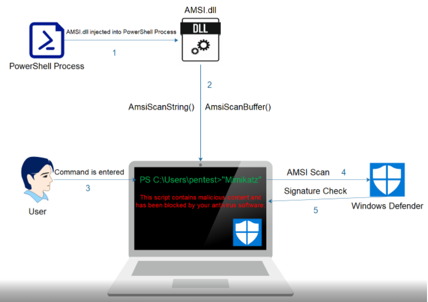

The unmanaged DLL, AMSI.dll, is loaded into every powershell process and provides a number of APIs which powershell uses. The APIs exported by AMSI are _AmsiInitialize_, _AmsiOpenSession_, _AmsiScanString_, _AmsiScanBuffer_ and _AmsiCloseSession_.

**_AmsiInitialize_**

Function :

    HRESULT AmsiInitialize(
      LPCWSTR appName,
      HAMSICONTEXT \*amsiContext
    );

Explanation :

1. The first argument is the name of the application.
2. The next argument is the pointer to the context structure.

   &nbsp;

> **NOTE** : The call to _AmsiInitialize_ is made before we can invoke any powershell command, hence we cannot influence it in any way.

&nbsp;

**_AmsiOpenSession_**

Function :

    HRESULT AmsiOpenSession(
      HAMSICONTEXT amsiContext,
      HAMSISESSION \*amsiSession
    );

Explanation :

1. The first argument takes the _AmsiContext_ context structure.
2. The second argument accepts this context and creates a session for it. This session structure will be used in all calls for that session.

&nbsp;

**_AmsiScanBuffer_**

Function :

    HRESULT AmsiScanBuffer(
      HAMSICONTEXT amsiContext,
      PVOID buffer,
      ULONG length,
      LPCWSTR contentName,
      HAMSISESSION amsiSession,
      AMSI_RESULT *result
    );

Explanation :

1. The first argument handles the context recieved from _AmsiInitialize_
2. The second argument stores the buffer which has to be scanned.
3. The third argument stores the length of the buffer.
4. The fourth argument contains the filename/URL/unique String etc. Anything to identify the buffer being scanned.
5. The fifth argument contains the session recieved by the _AmsiOpenSession_. It is used if multiple scan requests are to be done within a session, otherwise it is set to **nullptr**
6. The sixth argument stores the result of the scan. If it returns "1", then it indicates clean scan and a return value of "32768" indicates the presence of malware.

> NOTE :
>
> - Once the session is over, the _AmsiCloseSession_ will close the current AMSI scanning Session.
> - The _AmsiScanBuffer_ precedes the _AmsiScanString_ as the latter was vulnerable to trivial AMSI bypass attacks.

&nbsp;

> RESOURCES :
>
> - https://docs.microsoft.com/en-us/windows/win32/api/amsi/nf-amsi-amsiinitialize
> - https://docs.microsoft.com/en-us/windows/win32/api/amsi/nf-amsi-amsiopensession
> - https://docs.microsoft.com/en-us/windows/win32/api/amsi/nf-amsi-amsiscanstring
> - https://docs.microsoft.com/en-us/windows/win32/api/amsi/nf-amsi-amsiscanbuffer
> - https://docs.microsoft.com/en-us/windows/win32/api/amsi/nf-amsi-amsiclosesession
> - https://docs.microsoft.com/en-gb/windows/win32/api/amsi/ne-amsi-amsi_result

&nbsp;

## Dynamic Analysis of AMSI with Frida

Frida is a debugging tool with a dynamic intrumentation framework. It has a python backend with a javascript frontend.

Command to install frida :

    pip install frida-tools

Also add the path to your Environment variables. Go to System Properties > Environment Variables > Path

The path for me is :

    C:\Users\IEUser\AppData\Local\Programs\Python\Python310\Scripts\

This can vary according to your user and where you have python installed.

Now open powershell and get it's process id with the command :

    Get-Process | Select-Object -Property Id,ProcessName | Where-Object {$_.ProcessName -like "*power*"}

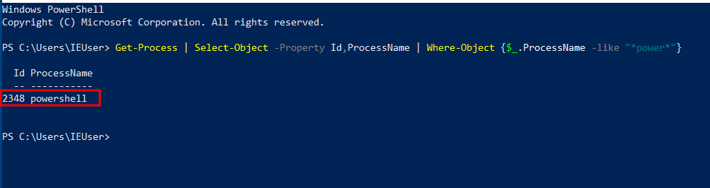

Open a new powershell instance and run the same command again, this time note down the new process id :

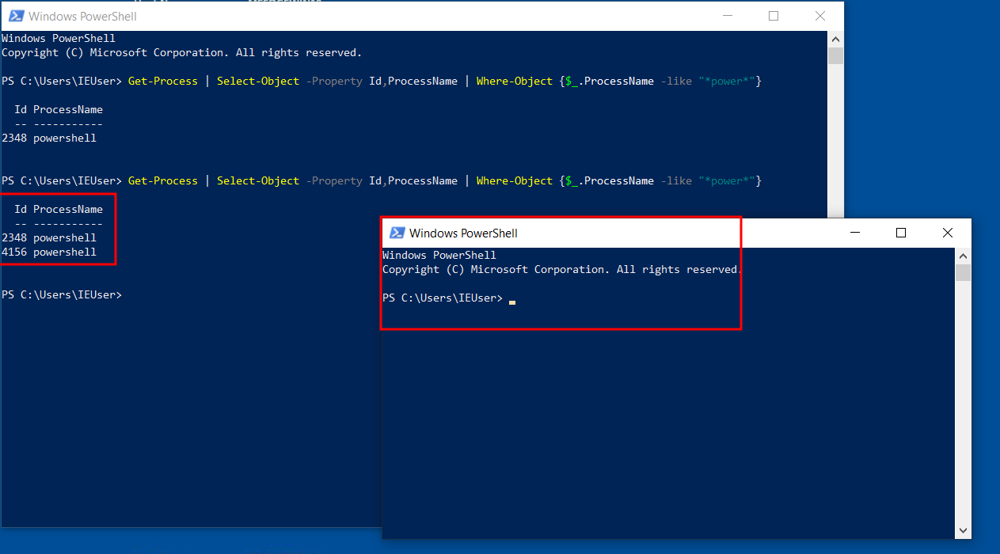

Run frida-trace on the new process :

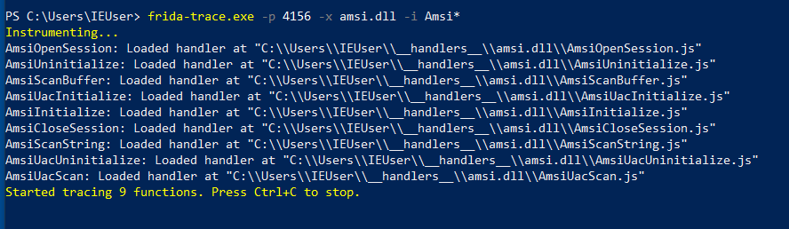

Flags :

-p : process id \
-x : the DLL to trace \
-i : specific API's to trace \

Now when we enter any string, we can see the API calls being made :

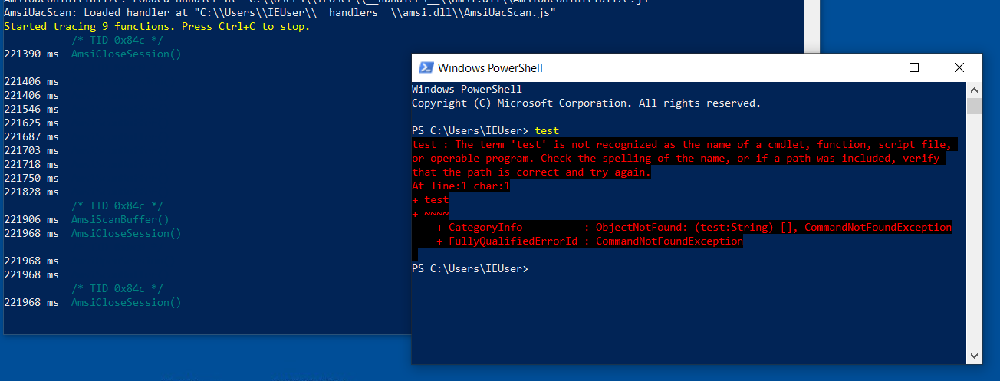

When we start a Frida session, handler files are created for each hooked API :

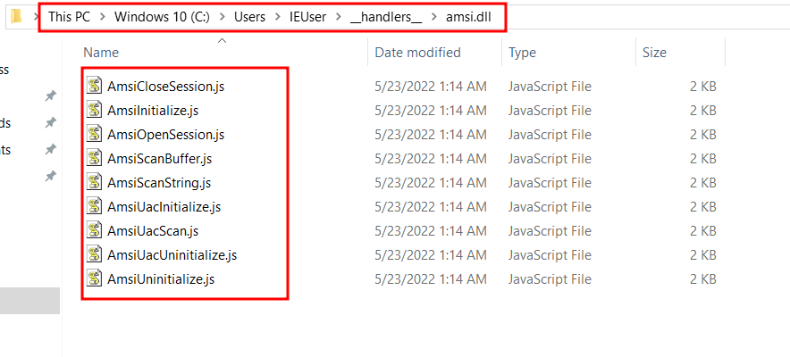

We can view the _AmsiScanBuffer_ file to see what the handler does when that API is encountered :

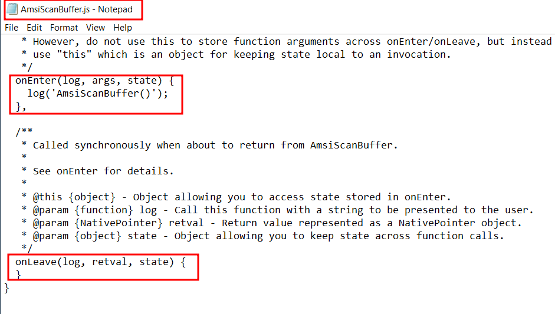

We can edit the _OnEnter_ function to display more information when encountered :

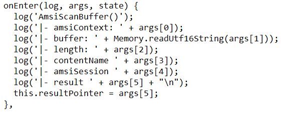

Explanation :

1. The values of different argument of the API are stored in the **_args_** variable.
2. The readUtf16String is to print out the content in Unicode format.
3. The last argument is the resultPointer for the result of the Amsi scan. It is a javascript variable and we can use the "this" keyword to access it later.

Similarly we can edit the _onLeave_ function :

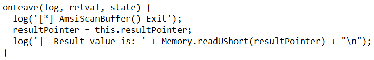

Explanation :

1. We use the "this" keyword to get the result of the resultPointer.
2. We use readUShort to print out the result to the console.

Now let us test out this code by entering a random string :

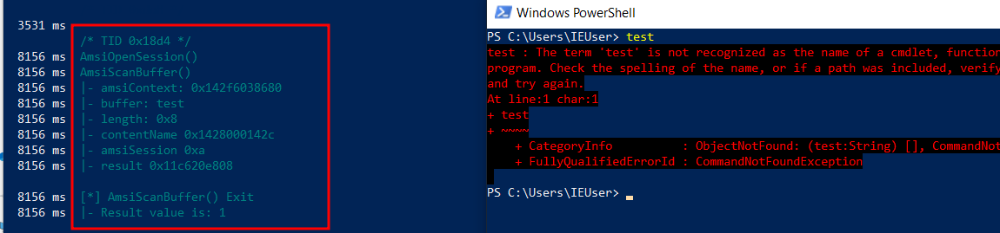

> **NOTE** : We can see that the result is "1", which says the entered text did not trigger any AV.

Now let us try the same with a string which may get flagged :

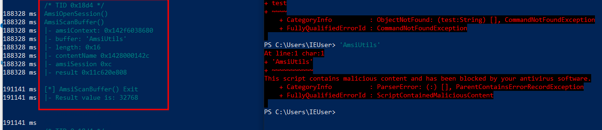

We can see that the result is "32768" and also we got a malicious activity error on our powershell.

Now tring to bypass this by splitting and concatenating the string :

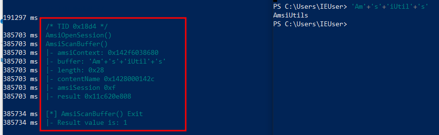

&nbsp;

> RESOURCES :
>
> - https://www.frida.re/docs/javascript-api/#memory
> - https://developer.mozilla.org/en-US/docs/Web/JavaScript/Reference/Operators/this
> - https://www.frida.re/

&nbsp;

# Bypassing AMSI with Reflection
